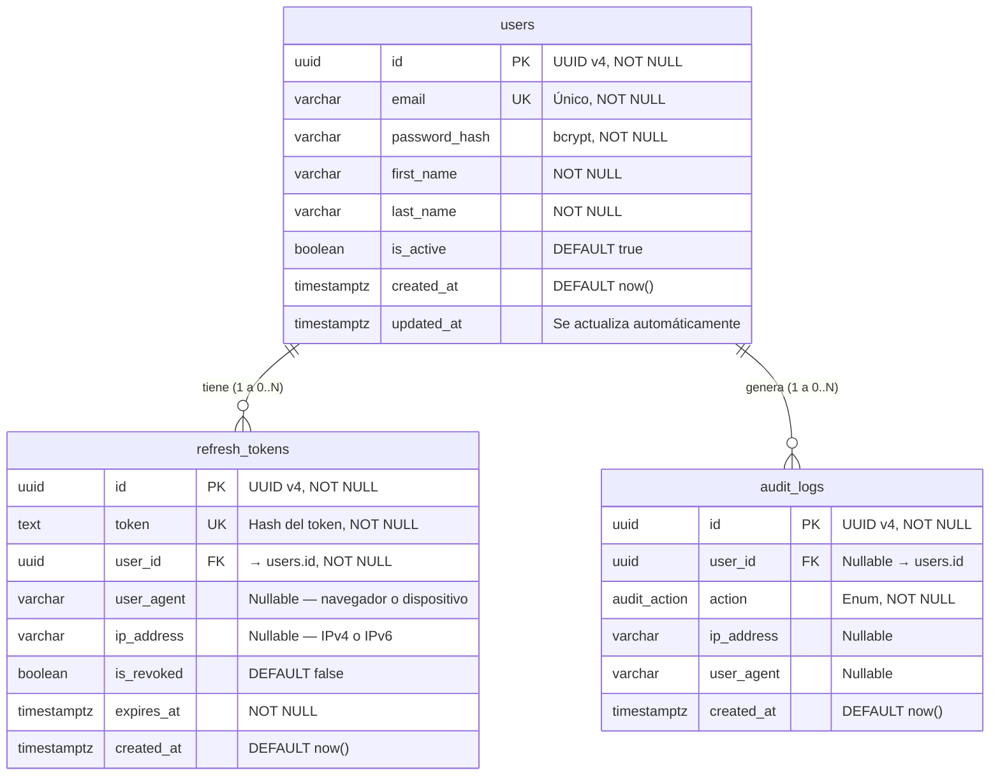

# DATABASE.md — Microservicio de Identidad (Identity Service)

> **Estado:** Pendiente de validación y firma del equipo  
> **Versión:** 1.0.0  
> **Motor:** PostgreSQL 15+  
> **ORM:** Prisma 6+

---

## Tabla de contenidos

- [Diagrama relacional](#diagrama-relacional)
- [Descripción de tablas](#descripción-de-tablas)
  - [users](#tabla-users)
  - [refresh\_tokens](#tabla-refresh_tokens)
  - [audit\_logs](#tabla-audit_logs)
- [Enum: audit\_action](#enum-audit_action)
- [Reglas de integridad referencial](#reglas-de-integridad-referencial)
- [Cardinalidad y sesiones concurrentes](#cardinalidad-y-sesiones-concurrentes)
- [Convenciones de nomenclatura](#convenciones-de-nomenclatura)
- [Schema Prisma completo](#schema-prisma-completo)
- [Checklist de validación](#checklist-de-validación)

---

## Diagrama relacional



---

## Descripción de tablas

### Tabla `users`

Almacena las cuentas registradas en el sistema. Es la entidad central del microservicio de identidad.

| Columna         | Tipo PostgreSQL | Restricciones             | Descripción                                      |
|-----------------|-----------------|---------------------------|--------------------------------------------------|
| `id`            | `UUID`          | PK, NOT NULL              | Identificador único generado con UUID v4         |
| `email`         | `VARCHAR`       | UNIQUE, NOT NULL          | Dirección de correo. Usada como identificador de login |
| `password_hash` | `VARCHAR`       | NOT NULL                  | Contraseña cifrada con bcrypt (mínimo 12 rounds) |
| `first_name`    | `VARCHAR`       | NOT NULL                  | Nombre del usuario                               |
| `last_name`     | `VARCHAR`       | NOT NULL                  | Apellido del usuario                             |
| `is_active`     | `BOOLEAN`       | NOT NULL, DEFAULT `true`  | Permite suspender cuentas sin eliminarlas        |
| `created_at`    | `TIMESTAMPTZ`   | NOT NULL, DEFAULT `now()` | Fecha de registro en UTC                         |
| `updated_at`    | `TIMESTAMPTZ`   | NOT NULL                  | Se actualiza automáticamente en cada cambio      |

**Índices:**
- `PRIMARY KEY (id)`
- `UNIQUE INDEX ON (email)`

---

### Tabla `refresh_tokens`

Registra cada sesión activa de un usuario. Un mismo usuario puede tener múltiples registros simultáneos (ej. laptop, app móvil, tablet).

| Columna      | Tipo PostgreSQL | Restricciones             | Descripción                                              |
|--------------|-----------------|---------------------------|----------------------------------------------------------|
| `id`         | `UUID`          | PK, NOT NULL              | Identificador único de la sesión                         |
| `token`      | `TEXT`          | UNIQUE, NOT NULL          | Hash del refresh token (nunca se guarda en texto plano)  |
| `user_id`    | `UUID`          | FK → `users.id`, NOT NULL | Propietario de la sesión                                 |
| `user_agent` | `VARCHAR`       | Nullable                  | Información del cliente: navegador o app móvil           |
| `ip_address` | `VARCHAR`       | Nullable                  | IP del cliente al momento de crear la sesión (IPv4/IPv6) |
| `is_revoked` | `BOOLEAN`       | NOT NULL, DEFAULT `false` | Permite invalidar manualmente una sesión                 |
| `expires_at` | `TIMESTAMPTZ`   | NOT NULL                  | Expiración estricta del token en UTC                     |
| `created_at` | `TIMESTAMPTZ`   | NOT NULL, DEFAULT `now()` | Inicio de la sesión en UTC                               |

**Índices:**
- `PRIMARY KEY (id)`
- `UNIQUE INDEX ON (token)`
- `INDEX ON (user_id)` — para consultar sesiones activas de un usuario

**Comportamiento de borrado:**  
`ON DELETE CASCADE` desde `users.id` → si el usuario es eliminado, todos sus tokens se eliminan automáticamente.

---

### Tabla `audit_logs`

Registra eventos de seguridad para trazabilidad y auditoría. Los registros son inmutables una vez creados (no tienen `updated_at`).

| Columna      | Tipo PostgreSQL | Restricciones             | Descripción                                                     |
|--------------|-----------------|---------------------------|-----------------------------------------------------------------|
| `id`         | `UUID`          | PK, NOT NULL              | Identificador único del evento                                  |
| `user_id`    | `UUID`          | FK nullable → `users.id`  | Usuario que generó el evento. Puede ser `NULL` si no existe     |
| `action`     | `audit_action`  | NOT NULL                  | Tipo de evento (ver enum abajo)                                 |
| `ip_address` | `VARCHAR`       | Nullable                  | IP del cliente durante el evento                                |
| `user_agent` | `VARCHAR`       | Nullable                  | Navegador o dispositivo del cliente                             |
| `created_at` | `TIMESTAMPTZ`   | NOT NULL, DEFAULT `now()` | Timestamp exacto del evento en UTC                              |

**Índices:**
- `PRIMARY KEY (id)`
- `INDEX ON (user_id)` — para consultar historial por usuario
- `INDEX ON (action)` — para filtrar por tipo de evento
- `INDEX ON (created_at)` — para consultas por rango de fechas

**Comportamiento de borrado:**  
`ON DELETE SET NULL` desde `users.id` → si el usuario es eliminado, el log se conserva con `user_id = NULL`. El historial de auditoría nunca se borra.

---

## Enum `audit_action`

Define los eventos de seguridad controlados que pueden registrarse en `audit_logs`.

| Valor              | Cuándo se registra                                           |
|--------------------|--------------------------------------------------------------|
| `LOGIN_SUCCESS`    | El usuario se autenticó correctamente                        |
| `LOGIN_FAILED`     | Credenciales inválidas o usuario inexistente                 |
| `REGISTER_SUCCESS` | Un nuevo usuario completó el registro                        |
| `TOKEN_REFRESH`    | El cliente solicitó un nuevo access token con refresh token  |
| `TOKEN_REVOKED`    | Una sesión fue invalidada manualmente                        |
| `LOGOUT`           | El usuario cerró sesión explícitamente                       |

---

## Reglas de integridad referencial

| Relación                          | Cardinalidad | ON DELETE      | Justificación                                                   |
|-----------------------------------|--------------|----------------|-----------------------------------------------------------------|
| `users` → `refresh_tokens`        | 1 a 0..N     | `CASCADE`      | Los tokens no tienen sentido sin el usuario. Se limpian solos.  |
| `users` → `audit_logs`            | 1 a 0..N     | `SET NULL`     | El historial de auditoría es inmutable. Se conserva con NULL.   |

---

## Cardinalidad y sesiones concurrentes

El diseño de `refresh_tokens` permite sesiones múltiples simultáneas por usuario:

```
Usuario (id: abc-123)
│
├── refresh_tokens (id: tok-001) → laptop Chrome / 192.168.1.10  → is_revoked: false
├── refresh_tokens (id: tok-002) → Android App / 203.0.113.5     → is_revoked: false
└── refresh_tokens (id: tok-003) → Safari iOS / 198.51.100.2     → is_revoked: true  ← sesión cerrada
```

Para invalidar **todas las sesiones** de un usuario (ej. "cerrar sesión en todos los dispositivos"), se actualiza `is_revoked = true` en todos los tokens donde `user_id = ?` y `is_revoked = false`.

Para invalidar **una sesión específica**, se actualiza únicamente el token identificado por su hash.

---

## Convenciones de nomenclatura

| Elemento          | Convención          | Ejemplo                        |
|-------------------|---------------------|--------------------------------|
| Tablas            | `snake_case` plural | `refresh_tokens`, `audit_logs` |
| Columnas          | `snake_case`        | `user_id`, `created_at`        |
| Claves primarias  | `id`                | `id UUID`                      |
| Claves foráneas   | `{tabla_singular}_id` | `user_id`                    |
| Timestamps        | `_at` suffix        | `created_at`, `expires_at`     |
| Booleanos         | `is_` prefix        | `is_active`, `is_revoked`      |
| Enums             | `snake_case`        | `audit_action`                 |
| Valores de enum   | `SCREAMING_SNAKE_CASE` | `LOGIN_SUCCESS`             |

**Mapeo Prisma → PostgreSQL:**  
Los modelos Prisma usan `PascalCase` y `camelCase` (convención TypeScript). El mapeo a `snake_case` se hace con `@map` y `@@map`:

```prisma
model RefreshToken {        // nombre en TypeScript
  userId String @map("user_id")  // columna en PostgreSQL
  @@map("refresh_tokens")        // tabla en PostgreSQL
}
```

---

## Schema Prisma completo

```prisma
// schema.prisma

generator client {
  provider = "prisma-client-js"
}

datasource db {
  provider = "postgresql"
  url      = env("DATABASE_URL")
}

// ─── Enum ────────────────────────────────────────────────────────────────────

enum AuditAction {
  LOGIN_SUCCESS
  LOGIN_FAILED
  REGISTER_SUCCESS
  TOKEN_REFRESH
  TOKEN_REVOKED
  LOGOUT

  @@map("audit_action")
}

// ─── Modelos ──────────────────────────────────────────────────────────────────

model User {
  id           String   @id @default(uuid())
  email        String   @unique
  passwordHash String   @map("password_hash")
  firstName    String   @map("first_name")
  lastName     String   @map("last_name")
  isActive     Boolean  @default(true) @map("is_active")
  createdAt    DateTime @default(now()) @map("created_at") @db.Timestamptz
  updatedAt    DateTime @updatedAt @map("updated_at") @db.Timestamptz

  // Relaciones
  refreshTokens RefreshToken[]
  auditLogs     AuditLog[]

  @@map("users")
}

model RefreshToken {
  id        String   @id @default(uuid())
  token     String   @unique
  userId    String   @map("user_id")
  userAgent String?  @map("user_agent")
  ipAddress String?  @map("ip_address")
  isRevoked Boolean  @default(false) @map("is_revoked")
  expiresAt DateTime @map("expires_at") @db.Timestamptz
  createdAt DateTime @default(now()) @map("created_at") @db.Timestamptz

  // Relación con usuario (CASCADE: si el user se borra, el token también)
  user User @relation(fields: [userId], references: [id], onDelete: Cascade)

  @@map("refresh_tokens")
}

model AuditLog {
  id        String      @id @default(uuid())
  userId    String?     @map("user_id")
  action    AuditAction
  ipAddress String?     @map("ip_address")
  userAgent String?     @map("user_agent")
  createdAt DateTime    @default(now()) @map("created_at") @db.Timestamptz

  // Relación opcional (SET NULL: si el user se borra, el log se conserva con null)
  user User? @relation(fields: [userId], references: [id], onDelete: SetNull)

  @@map("audit_logs")
}
```

---

## Checklist de validación

Antes de iniciar las migraciones, el equipo debe confirmar cada punto:

- [ ] Los nombres de tablas y columnas están en `snake_case` y corresponden a los definidos en este documento
- [ ] El mapeo Prisma (`@map` / `@@map`) es correcto y consistente con PostgreSQL
- [ ] La relación `users → refresh_tokens` usa `onDelete: Cascade`
- [ ] La relación `users → audit_logs` usa `onDelete: SetNull`
- [ ] El campo `user_id` en `audit_logs` es nullable (`String?`) para soportar logins fallidos de usuarios inexistentes
- [ ] El campo `token` en `refresh_tokens` almacena el **hash** del token, nunca el valor en texto plano
- [ ] El enum `AuditAction` cubre el 100% de los eventos de seguridad del proyecto
- [ ] Los campos de timestamp usan `TIMESTAMPTZ` (con zona horaria) y no `TIMESTAMP`
- [ ] El modelo fue revisado y aprobado por todo el equipo antes de correr `prisma migrate dev`
