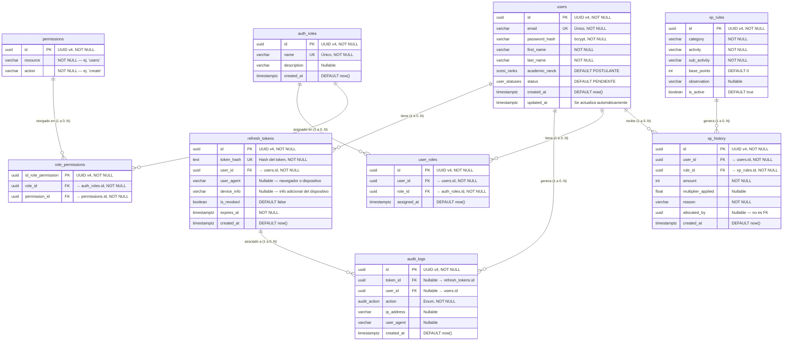

# DATABASE.md — Microservicio de Identidad (Identity Service)

> **Estado:** Pendiente de validación y firma del equipo
> **Versión:** 1.1.0
> **Motor:** PostgreSQL 15+
> **ORM:** Prisma 6+

---

## Tabla de contenidos

- [Diagrama relacional](#diagrama-relacional)
- [Descripción de tablas](#descripción-de-tablas)
  - [users](#tabla-users)
  - [refresh\_tokens](#tabla-refresh_tokens)
  - [audit\_logs](#tabla-audit_logs)
  - [auth\_roles](#tabla-auth_roles)
  - [permissions](#tabla-permissions)
  - [role\_permissions](#tabla-role_permissions)
  - [user\_roles](#tabla-user_roles)
  - [xp\_rules](#tabla-xp_rules)
  - [xp\_history](#tabla-xp_history)
- [Enums](#enums)
  - [audit\_action](#enum-audit_action)
  - [user\_statuses](#enum-user_statuses)
  - [scesi\_ranks](#enum-scesi_ranks)
- [Reglas de integridad referencial](#reglas-de-integridad-referencial)
- [Cardinalidad y sesiones concurrentes](#cardinalidad-y-sesiones-concurrentes)
- [RBAC: diseño many-to-many](#rbac-diseño-many-to-many)
- [Convenciones de nomenclatura](#convenciones-de-nomenclatura)
- [Checklist de validación](#checklist-de-validación)
- [Changelog](#changelog)

---

## Diagrama relacional



---

## Descripción de tablas

### Tabla `users`

Almacena las cuentas registradas en el sistema. Es la entidad central del microservicio de identidad.

| Columna         | Tipo PostgreSQL | Restricciones             | Descripción                                              |
|-----------------|-----------------|----------------------------|-------------------------------------------------------------|
| `id`            | `UUID`          | PK, NOT NULL                | Identificador único generado con UUID v4                     |
| `email`         | `VARCHAR`       | UNIQUE, NOT NULL            | Dirección de correo. Usada como identificador de login        |
| `password_hash` | `VARCHAR`       | NOT NULL                    | Contraseña cifrada con bcrypt (mínimo 12 rounds)               |
| `first_name`    | `VARCHAR`       | NOT NULL                    | Nombre del usuario                                              |
| `last_name`     | `VARCHAR`       | NOT NULL                    | Apellido del usuario                                             |
| `academic_ranck`| `scesi_ranks`   | NOT NULL, DEFAULT `POSTULANTE` | Rango académico del usuario dentro de SCESI (ver enum abajo) |
| `status`        | `user_statuses` | NOT NULL, DEFAULT `PENDIENTE`  | Estado de la cuenta (ver enum abajo). Reemplaza el antiguo `is_active` booleano |
| `created_at`    | `TIMESTAMPTZ`   | NOT NULL, DEFAULT `now()`   | Fecha de registro en UTC                                          |
| `updated_at`    | `TIMESTAMPTZ`   | NOT NULL                    | Se actualiza automáticamente en cada cambio                       |

**Índices:**
- `PRIMARY KEY (id)`
- `UNIQUE INDEX ON (email)`

> **Nota:** el campo `is_active BOOLEAN` documentado en la versión anterior fue reemplazado por `status user_statuses`, que permite distinguir entre cuentas pendientes de aprobación, activas e inactivas en lugar de un simple on/off.

---

### Tabla `refresh_tokens`

Registra cada sesión activa de un usuario. Un mismo usuario puede tener múltiples registros simultáneos (ej. laptop, app móvil, tablet).

| Columna       | Tipo PostgreSQL | Restricciones             | Descripción                                              |
|---------------|-----------------|----------------------------|--------------------------------------------------------------|
| `id`          | `UUID`          | PK, NOT NULL                | Identificador único de la sesión                               |
| `token_hash`  | `TEXT`          | UNIQUE, NOT NULL            | Hash del refresh token (nunca se guarda en texto plano). **Renombrado desde `token`** |
| `user_id`     | `UUID`          | FK → `users.id`, NOT NULL   | Propietario de la sesión                                        |
| `user_agent`  | `VARCHAR`       | Nullable                    | Información del cliente: navegador o app móvil                   |
| `device_info` | `VARCHAR`       | Nullable                    | Información adicional del dispositivo (modelo, SO, etc.). **Campo nuevo, antes no documentado** |
| `is_revoked`  | `BOOLEAN`       | NOT NULL, DEFAULT `false`   | Permite invalidar manualmente una sesión                          |
| `expires_at`  | `TIMESTAMPTZ`   | NOT NULL                    | Expiración estricta del token en UTC                                |
| `created_at`  | `TIMESTAMPTZ`   | NOT NULL, DEFAULT `now()`   | Inicio de la sesión en UTC                                          |

**Índices:**
- `PRIMARY KEY (id)`
- `UNIQUE INDEX ON (token_hash)`
- `INDEX ON (user_id)` — para consultar sesiones activas de un usuario

**Comportamiento de borrado:**
`ON DELETE CASCADE` desde `users.id` → si el usuario es eliminado, todos sus tokens se eliminan automáticamente.

> **Nota:** el campo `ip_address` documentado en la versión anterior de esta tabla no existe en el schema actual. La IP del cliente en la creación de la sesión se registra a través de `audit_logs.ip_address` (evento `LOGIN_SUCCESS` asociado por `token_id`).

---

### Tabla `audit_logs`

Registra eventos de seguridad para trazabilidad y auditoría. Los registros son inmutables una vez creados (no tienen `updated_at`).

| Columna      | Tipo PostgreSQL | Restricciones                        | Descripción                                                          |
|--------------|-----------------|----------------------------------------|--------------------------------------------------------------------------|
| `id`         | `UUID`          | PK, NOT NULL                            | Identificador único del evento                                            |
| `token_id`   | `UUID`          | FK nullable → `refresh_tokens.id`       | Sesión asociada al evento (ej. a qué refresh token corresponde un `TOKEN_REFRESH` o `LOGOUT`). **Campo nuevo, antes no documentado ni relacionado** |
| `user_id`    | `UUID`          | FK nullable → `users.id`                | Usuario que generó el evento. Puede ser `NULL` si no existe               |
| `action`     | `audit_action`  | NOT NULL                                | Tipo de evento (ver enum abajo)                                            |
| `ip_address` | `VARCHAR`       | Nullable                                | IP del cliente durante el evento                                           |
| `user_agent` | `VARCHAR`       | Nullable                                | Navegador o dispositivo del cliente                                        |
| `created_at` | `TIMESTAMPTZ`   | NOT NULL, DEFAULT `now()`               | Timestamp exacto del evento en UTC                                         |

**Índices:**
- `PRIMARY KEY (id)`
- `INDEX ON (user_id)` — para consultar historial por usuario
- `INDEX ON (token_id)` — para consultar el historial de una sesión específica
- `INDEX ON (action)` — para filtrar por tipo de evento
- `INDEX ON (created_at)` — para consultas por rango de fechas

**Comportamiento de borrado:**
- `ON DELETE SET NULL` desde `users.id` → si el usuario es eliminado, el log se conserva con `user_id = NULL`. El historial de auditoría nunca se borra.
- `ON DELETE SET NULL` desde `refresh_tokens.id` → si el refresh token es eliminado (o expira y se purga), el log se conserva con `token_id = NULL`. Mismo principio de inmutabilidad del historial.

> **Fix aplicado (PR #15, comentario #3):** en la versión anterior del schema, `token_id` existía como columna pero **sin `@relation` en Prisma**, por lo que no había validación de integridad referencial a nivel de base de datos — cualquier UUID (o uno inexistente) podía guardarse ahí sin error. Se agregó la relación explícita hacia `refresh_tokens.id` con `onDelete: SetNull`.

---

### Tabla `auth_roles`

Catálogo de roles del sistema (ej. `admin`, `moderador`, `estudiante`).

| Columna       | Tipo PostgreSQL | Restricciones             | Descripción                          |
|---------------|-----------------|----------------------------|----------------------------------------|
| `id`          | `UUID`          | PK, NOT NULL                | Identificador único del rol             |
| `name`        | `VARCHAR`       | UNIQUE, NOT NULL            | Nombre del rol                          |
| `description` | `VARCHAR`       | Nullable                    | Descripción legible del rol             |
| `created_at`  | `TIMESTAMPTZ`   | NOT NULL, DEFAULT `now()`   | Fecha de creación del rol               |

**Índices:**
- `PRIMARY KEY (id)`
- `UNIQUE INDEX ON (name)`

---

### Tabla `permissions`

Catálogo de permisos del sistema, expresados como par `resource` + `action` (ej. `users` + `create`).

| Columna    | Tipo PostgreSQL | Restricciones | Descripción                              |
|------------|-----------------|----------------|---------------------------------------------|
| `id`       | `UUID`          | PK, NOT NULL     | Identificador único del permiso              |
| `resource` | `VARCHAR`       | NOT NULL         | Recurso sobre el que aplica (ej. `"users"`, `"xp_rules"`) |
| `action`   | `VARCHAR`       | NOT NULL         | Acción permitida (ej. `"create"`, `"read"`, `"update"`, `"delete"`) |

**Índices:**
- `PRIMARY KEY (id)`
- `UNIQUE INDEX ON (resource, action)` — no pueden existir dos permisos idénticos

> **Fix aplicado (PR #15, comentario #4-5):** la versión previa del schema tenía además una columna `role_id` en `permissions`, que asignaba cada permiso a un único rol — esto contradecía el propósito de la tabla puente `role_permissions` (many-to-many). Se eliminó `role_id` de `permissions`; ver [RBAC: diseño many-to-many](#rbac-diseño-many-to-many).

---

### Tabla `role_permissions`

Tabla puente que resuelve la relación muchos-a-muchos entre `auth_roles` y `permissions`.

| Columna             | Tipo PostgreSQL | Restricciones                    | Descripción                          |
|---------------------|-----------------|------------------------------------|------------------------------------------|
| `id_role_permission`| `UUID`          | PK, NOT NULL                        | Identificador único de la asociación      |
| `role_id`           | `UUID`          | FK → `auth_roles.id`, NOT NULL      | Rol al que se le otorga el permiso        |
| `permission_id`     | `UUID`          | FK → `permissions.id`, NOT NULL     | Permiso otorgado                          |

**Índices:**
- `PRIMARY KEY (id_role_permission)`
- `UNIQUE INDEX ON (role_id, permission_id)` — evita asignar el mismo permiso dos veces al mismo rol

**Comportamiento de borrado:**
`ON DELETE CASCADE` desde `auth_roles.id` y desde `permissions.id` → si el rol o el permiso se eliminan, la asociación se elimina junto con ellos.

---

### Tabla `user_roles`

Tabla puente que resuelve la relación muchos-a-muchos entre `users` y `auth_roles` (un usuario puede tener varios roles).

| Columna       | Tipo PostgreSQL | Restricciones                 | Descripción                      |
|---------------|-----------------|----------------------------------|--------------------------------------|
| `id`          | `UUID`          | PK, NOT NULL                      | Identificador único de la asignación  |
| `user_id`     | `UUID`          | FK → `users.id`, NOT NULL         | Usuario al que se le asigna el rol    |
| `role_id`     | `UUID`          | FK → `auth_roles.id`, NOT NULL    | Rol asignado                          |
| `assigned_at` | `TIMESTAMPTZ`   | NOT NULL, DEFAULT `now()`         | Fecha de asignación del rol           |

**Índices:**
- `PRIMARY KEY (id)`
- `UNIQUE INDEX ON (user_id, role_id)` — evita asignar el mismo rol dos veces al mismo usuario

**Comportamiento de borrado:**
`ON DELETE CASCADE` desde `users.id` y desde `auth_roles.id`.

---

### Tabla `xp_rules`

Catálogo de reglas configurables que definen cuántos puntos de experiencia (XP) otorga cada actividad del sistema de gamificación.

| Columna        | Tipo PostgreSQL | Restricciones             | Descripción                              |
|----------------|-----------------|----------------------------|---------------------------------------------|
| `id`           | `UUID`          | PK, NOT NULL                | Identificador único de la regla              |
| `category`     | `VARCHAR`       | NOT NULL                    | Categoría de la actividad (ej. `"académico"`) |
| `activity`     | `VARCHAR`       | NOT NULL                    | Actividad específica                          |
| `sub_activity` | `VARCHAR`       | NOT NULL                    | Sub-actividad puntual                         |
| `base_points`  | `INT`           | NOT NULL, DEFAULT `0`       | Puntos base otorgados                         |
| `observation`  | `VARCHAR`       | Nullable                    | Notas adicionales sobre la regla              |
| `is_active`    | `BOOLEAN`       | NOT NULL, DEFAULT `true`    | Permite desactivar una regla sin eliminarla   |

**Índices:**
- `PRIMARY KEY (id)`

---

### Tabla `xp_history`

Registro histórico e inmutable de XP otorgado a cada usuario.

| Columna              | Tipo PostgreSQL | Restricciones                | Descripción                                              |
|----------------------|-----------------|--------------------------------|--------------------------------------------------------------|
| `id`                 | `UUID`          | PK, NOT NULL                    | Identificador único del registro                               |
| `user_id`            | `UUID`          | FK → `users.id`, NOT NULL       | Usuario que recibe el XP                                        |
| `rule_id`            | `UUID`          | FK → `xp_rules.id`, NOT NULL    | Regla que originó el otorgamiento                                |
| `amount`             | `INT`           | NOT NULL                        | Puntos efectivamente otorgados                                   |
| `multiplier_applied` | `FLOAT`         | Nullable                        | Multiplicador aplicado sobre `base_points`, si corresponde        |
| `reason`             | `VARCHAR`       | NOT NULL                        | Justificación del otorgamiento                                    |
| `allocated_by`       | `UUID`          | Nullable, **no es FK**          | Identificador de quien asignó el XP (ej. un admin). No referencia `users.id` directamente en el schema actual |
| `created_at`         | `TIMESTAMPTZ`   | NOT NULL, DEFAULT `now()`       | Fecha del otorgamiento                                             |

**Índices:**
- `PRIMARY KEY (id)`
- `INDEX ON (user_id)` — para consultar historial de XP de un usuario
- `INDEX ON (rule_id)`

**Comportamiento de borrado:**
`ON DELETE CASCADE` desde `users.id` y desde `xp_rules.id`.

> **Nota de diseño abierta:** `allocated_by` no tiene FK hacia `users.id`. Si se requiere trazabilidad estricta de quién otorgó el XP (ej. para auditoría de administradores), se recomienda evaluar agregar la relación en una futura migración.

---

## Enums

### Enum `audit_action`

Define los eventos de seguridad controlados que pueden registrarse en `audit_logs`.

| Valor              | Cuándo se registra                                           |
|--------------------|------------------------------------------------------------------|
| `LOGIN_SUCCESS`    | El usuario se autenticó correctamente                              |
| `LOGIN_FAILED`     | Credenciales inválidas o usuario inexistente                       |
| `REGISTER_SUCCESS` | Un nuevo usuario completó el registro                               |
| `TOKEN_REFRESH`    | El cliente solicitó un nuevo access token con refresh token         |
| `TOKEN_REVOKED`    | Una sesión fue invalidada manualmente                               |
| `LOGOUT`           | El usuario cerró sesión explícitamente                              |

### Enum `user_statuses`

Estado de la cuenta del usuario. **No documentado en la versión anterior.**

| Valor       | Descripción                                                      |
|-------------|------------------------------------------------------------------------|
| `PENDIENTE` | Cuenta registrada, pendiente de aprobación o verificación (estado por defecto al crear) |
| `ACTIVO`    | Cuenta habilitada, puede iniciar sesión y operar normalmente            |
| `INACTIVO`  | Cuenta suspendida/deshabilitada, no puede iniciar sesión                 |

### Enum `scesi_ranks`

Rango académico del usuario dentro de SCESI. **No documentado en la versión anterior.**

| Valor         | Descripción              |
|---------------|-----------------------------|
| `POSTULANTE`  | Rango inicial (por defecto)  |
| `JUNIOR`      |                              |
| `INTERMEDIO`  |                              |
| `AVANZADO`    |                              |
| `HONORARIO`   | Rango honorífico              |

---

## Reglas de integridad referencial

| Relación                                | Cardinalidad | ON DELETE  | Justificación                                                     |
|------------------------------------------|--------------|------------|------------------------------------------------------------------------|
| `users` → `refresh_tokens`                | 1 a 0..N     | `CASCADE`  | Los tokens no tienen sentido sin el usuario. Se limpian solos.         |
| `users` → `audit_logs`                    | 1 a 0..N     | `SET NULL` | El historial de auditoría es inmutable. Se conserva con NULL.          |
| `refresh_tokens` → `audit_logs`           | 1 a 0..N     | `SET NULL` | Igual que arriba: el log sobrevive aunque el token se elimine.         |
| `users` → `user_roles`                    | 1 a 0..N     | `CASCADE`  | Las asignaciones de rol no tienen sentido sin el usuario.               |
| `auth_roles` → `user_roles`               | 1 a 0..N     | `CASCADE`  | Igual, sin el rol la asignación no tiene sentido.                        |
| `auth_roles` → `role_permissions`         | 1 a 0..N     | `CASCADE`  | Al eliminar un rol, se eliminan sus asociaciones de permisos.            |
| `permissions` → `role_permissions`        | 1 a 0..N     | `CASCADE`  | Al eliminar un permiso, se eliminan sus asociaciones a roles.             |
| `users` → `xp_history`                    | 1 a 0..N     | `CASCADE`  | El historial de XP pertenece exclusivamente al usuario.                   |
| `xp_rules` → `xp_history`                 | 1 a 0..N     | `CASCADE`  | Sin la regla que lo originó, el registro de XP pierde contexto.           |

---

## Cardinalidad y sesiones concurrentes

El diseño de `refresh_tokens` permite sesiones múltiples simultáneas por usuario:

```
Usuario (id: abc-123)
│
├── refresh_tokens (id: tok-001) → laptop Chrome  → is_revoked: false
├── refresh_tokens (id: tok-002) → Android App     → is_revoked: false
└── refresh_tokens (id: tok-003) → Safari iOS      → is_revoked: true  ← sesión cerrada
```

Para invalidar **todas las sesiones** de un usuario (ej. "cerrar sesión en todos los dispositivos"), se actualiza `is_revoked = true` en todos los tokens donde `user_id = ?` y `is_revoked = false`.

Para invalidar **una sesión específica**, se actualiza únicamente el token identificado por su hash.

---

## RBAC: diseño many-to-many

El sistema de roles y permisos usa dos tablas puente independientes:

```
users ──< user_roles >── auth_roles ──< role_permissions >── permissions
```

- Un **usuario** puede tener **muchos roles** (`user_roles`).
- Un **rol** puede tener **muchos permisos**, y un **permiso** puede pertenecer a **muchos roles** (`role_permissions`).
- `permissions` **no** tiene FK directa a `auth_roles`: toda asociación rol↔permiso pasa exclusivamente por `role_permissions`.

Esto reemplaza el diseño anterior, donde `permissions.role_id` forzaba a que cada permiso perteneciera a un único rol — contradiciendo la existencia de la tabla puente `role_permissions` y haciendo imposible reutilizar un mismo permiso (ej. `users:read`) en más de un rol.

---

## Convenciones de nomenclatura

| Elemento          | Convención             | Ejemplo                        |
|-------------------|--------------------------|-----------------------------------|
| Tablas            | `snake_case` plural      | `refresh_tokens`, `audit_logs`     |
| Columnas          | `snake_case`             | `user_id`, `created_at`            |
| Claves primarias  | `id`                     | `id UUID`                          |
| Claves foráneas   | `{tabla_singular}_id`    | `user_id`, `role_id`               |
| Timestamps        | `_at` suffix             | `created_at`, `expires_at`         |
| Booleanos         | `is_` prefix             | `is_revoked`, `is_active`          |
| Enums             | `snake_case`             | `audit_action`, `user_statuses`    |
| Valores de enum   | `SCREAMING_SNAKE_CASE`   | `LOGIN_SUCCESS`, `PENDIENTE`       |

**Mapeo Prisma → PostgreSQL:**
Los modelos Prisma usan `PascalCase` y `camelCase` (convención TypeScript). El mapeo a `snake_case` se hace con `@map` y `@@map`:

```prisma
model RefreshToken {              // nombre en TypeScript
  tokenHash String @map("token_hash")  // columna en PostgreSQL
  @@map("refresh_tokens")              // tabla en PostgreSQL
}
```

---

## Checklist de validación

Antes de iniciar las migraciones, el equipo debe confirmar cada punto:

- [ ] Los nombres de tablas y columnas están en `snake_case` y corresponden a los definidos en este documento
- [ ] El mapeo Prisma (`@map` / `@@map`) es correcto y consistente con PostgreSQL
- [ ] La relación `users → refresh_tokens` usa `onDelete: Cascade`
- [ ] La relación `users → audit_logs` usa `onDelete: SetNull`
- [ ] La relación `refresh_tokens → audit_logs` (`tokenId`) usa `onDelete: SetNull`
- [ ] El campo `user_id` en `audit_logs` es nullable (`String?`) para soportar logins fallidos de usuarios inexistentes
- [ ] El campo `token_hash` en `refresh_tokens` almacena el **hash** del token, nunca el valor en texto plano
- [ ] El enum `AuditAction` cubre el 100% de los eventos de seguridad del proyecto
- [ ] `permissions` **no** tiene FK directa a `auth_roles`; toda asociación pasa por `role_permissions`
- [ ] `role_permissions` tiene `@@unique([roleId, permissionId])` para evitar duplicados
- [ ] `permissions` tiene `@@unique([resource, action])`
- [ ] Los campos de timestamp usan `TIMESTAMPTZ` (con zona horaria) y no `TIMESTAMP`
- [ ] Se evaluó si `xp_history.allocated_by` debe convertirse en FK hacia `users.id`
- [ ] El modelo fue revisado y aprobado por todo el equipo antes de correr `prisma migrate dev`
